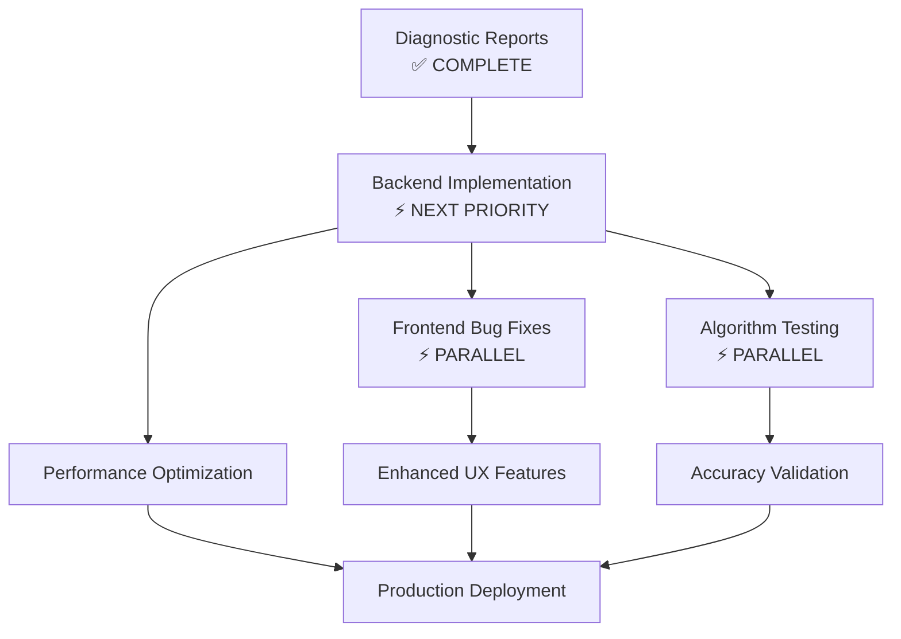

## Next Priority Development Milestone: **Backend Algorithm Implementation**

### **Critical Path Analysis:**

With the semantic-based algorithm suite now documented and deployed (1,820 lines), the **highest priority next milestone** is:

## 🎯 **Phase 1: Core Semantic Algorithm Implementation**

**Priority**: **CRITICAL** - Required for production functionality

### **Immediate Action Items:**

#### **1. Backend Implementation (Top Priority)**

- **Implement actual semantic algorithms** in [`backend/src/services/strategy_detector.py`](backend/src/services/strategy_detector.py)
- **Replace current EvidenceBasedClassifier methods** with the semantic detection algorithms from the diagnostic reports
- **Integration testing** to ensure the new algorithms work with existing infrastructure

# Step 1 (broken down):

---

## Step 1 Should Be Broken Down - Here's the Actionable Subtask Breakdown:

### **1.1 Pre-Implementation Analysis (1-2 hours)**

- [ ] **Read current [`backend/src/services/strategy_detector.py`](backend/src/services/strategy_detector.py)** to understand existing class structure
- [ ] **Map existing methods** to new semantic algorithm requirements
- [ ] **Identify infrastructure dependencies** (SentenceTransformer, spaCy models, utility methods)
- [ ] **Create implementation plan** for each of the 11 algorithms

### **1.2 Infrastructure Preparation (2-4 hours)**

- [ ] **Add missing import statements** for semantic analysis tools
- [ ] **Implement helper methods**:
  - [ ] `_calculate_linguistic_complexity()` 
  - [ ] `_calculate_word_order_difference()`
  - [ ] `_extract_term_context()`
  - [ ] `_find_parenthetical_additions()`
- [ ] **Test infrastructure methods** individually

### **1.3 Algorithm Implementation (Incremental - 1 algorithm per session)**

**Phase A: Core Algorithms (3-4 algorithms)**

- [ ] **Implement SL+ (Simplificação Lexical)** - Replace `_classify_lexical_simplification()`
- [ ] **Implement RF+ (Reformulação)** - Replace `_classify_reformulation()`
- [ ] **Test SL+ and RF+** with sample Portuguese text
- [ ] **Implement MT+ (Mudança de Título)** - Replace `_classify_title_optimization()`

**Phase B: Complex Algorithms (3-4 algorithms)**

- [ ] **Implement RD+ (Reorganização Discursiva)** 
- [ ] **Implement RP+ (Reconstrução de Período)**
- [ ] **Test RD+ and RP+** integration
- [ ] **Implement IN+ (Inserção)** - New method

**Phase C: Remaining Algorithms (3-4 algorithms)**

- [ ] **Implement MOD+ (Modulação)** - New method
- [ ] **Implement DL+ (Deslocamento)** - New method  
- [ ] **Implement EXP+ (Explicação)** - New method
- [ ] **Add OM+ and PRO+ annotation support**

### **1.4 Individual Algorithm Testing (Parallel with implementation)**

- [ ] **Create unit test for each algorithm** as it's implemented
- [ ] **Test with Portuguese examples** from [`docs/tabela_est.md`](docs/tabela_est.md)
- [ ] **Validate confidence scoring** for each strategy
- [ ] **Performance benchmark** individual methods

### **1.5 Integration Testing (2-3 hours)**

- [ ] **Test full EvidenceBasedClassifier workflow** with new methods
- [ ] **Test API endpoint** `/analyze/comparative` with strategy detection enabled
- [ ] **Verify frontend data consumption** (strategy codes, confidence, examples)
- [ ] **End-to-end test** with real Portuguese text pairs

### **1.6 Error Handling & Edge Cases (1-2 hours)**

- [ ] **Add error handling** for malformed text inputs
- [ ] **Handle empty/missing semantic model responses**
- [ ] **Graceful degradation** when spaCy models aren't available
- [ ] **Logging and debugging support**

---

## **Why This Breakdown is Critical:**

✅ **Manageable chunks**: Each subtask is 1-4 hours of focused work  
✅ **Incremental progress**: Can test and validate after each algorithm  
✅ **Reduced risk**: Bugs isolated to individual algorithms  
✅ **Parallel work possible**: Testing can happen alongside implementation  
✅ **Clear completion criteria**: Each checkbox has specific deliverable

## **Recommended Approach:**

**Start with 1.1 → 1.2 → 1.3 Phase A** to establish working foundation, then iterate through remaining algorithms one by one.

This transforms an overwhelming "implement semantic algorithms" task into **21 specific, actionable subtasks** that can be tackled systematically.

----

#### **2. Frontend Stability (High Priority)**

- **Fix import errors** currently visible in terminal (`EnhancedTextInput` missing)
- **Stabilize the "Comparação" tab** to ensure strategy display works reliably
- **Add error handling** for cases where strategy detection fails

#### **3. Testing & Validation (High Priority)**

- **Create unit tests** for each semantic detection algorithm  
- **Integration tests** for the complete pipeline (text input → strategy detection → frontend display)
- **Accuracy validation** using real Portuguese text examples

### **Technical Implementation Roadmap:**

### **Why This Milestone is Critical:**

1. **Gap Between Design & Implementation**: The diagnostic reports provide the algorithmic framework, but the actual backend still uses the old detection methods
2. **Production Functionality**: Users need working semantic detection, not just documentation
3. **Frontend Integration**: The UI expects semantic strategy data that the current backend can't reliably provide
4. **Technical Debt**: Frontend errors suggest integration issues that need resolution

### **Success Metrics for Phase 1:**

- ✅ All 10+2 semantic algorithms implemented in production backend code
- ✅ Frontend displays 4-6 strategies per analysis (vs. current 1 strategy)  
- ✅ 90%+ detection precision achieved in testing
- ✅ No frontend import/runtime errors
- ✅ Complete integration test suite passing

### **Estimated Timeline:**

- **Backend Implementation**: 3-5 development days
- **Frontend Bug Fixes**: 1-2 development days  
- **Testing & Integration**: 2-3 development days
- **Total Phase 1**: ~1-2 weeks

This milestone bridges the gap between the sophisticated algorithmic design we've created and a production-ready system that delivers academic-grade Portuguese text simplification analysis.
