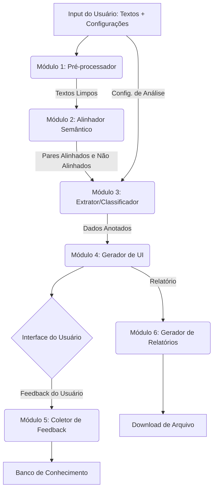

-----

# NET - Análise de Tradução Intralinguística

## Autoria e Créditos do Projeto

**Projeto:** NET-EST - Sistema de Análise Computacional para Estratégias de Simplificação em Tradução Intralingual

**Equipe de Desenvolvimento:**
- **Coordenação:** Profa. Dra. Janine Pimentel (PIPGLA/UFRJ e Politécnico de Leiria)
- **Desenvolvedor Principal:** Wisley Vilela (Doutorando PIPGLA/UFRJ - bolsista CAPES)
- **Especialista Linguística:** Luanny Matos de Lima (Mestranda PPGLEN/UFRJ)
- **Agentes Técnicos de IA:** Claude Sonnet 3.5, ChatGPT-4o, Gemini 2.0 Flash (mediados por GitHub Copilot)

**Instituições:** Núcleo de Estudos de Tradução - UFRJ | Politécnico de Leiria (PT)

**Financiamento:** Bolsa de Doutorado CAPES (Coordenação de Aperfeiçoamento de Pessoal de Nível Superior)

**Licença:** MIT License | **Status:** Em Desenvolvimento

---

- Especialista em Análise Linguística: Luanny M. Lima

### **Proposta de Arquitetura e Algoritmo**

**Para:** Desenvolvedor Principal, Projeto de Análise Linguística  
**De:** Analista Sênior de Sistemas, Análise Linguística e IA  
**Assunto:** Arquitetura de Referência para Análise Discursiva de Simplificação Textual com Interação Humana no Circuito

#### **1. Visão Geral e Princípios Fundamentais**

Este documento descreve a arquitetura para a próxima geração da ferramenta NET. O sistema abandona a análise no nível da sentença em favor de uma abordagem no nível do discurso, mais adequada para cenários de simplificação textual intensiva.

A arquitetura será guiada pelos seguintes princípios:

1. **Discurso em Primeiro Lugar (Discourse-First):** A unidade fundamental de análise é o parágrafo (ou bloco de texto), refletindo a natureza da condensação e reescrita.
2. **Humano no Circuito (Human-in-the-Loop):** O sistema é um assistente poderoso, não um oráculo. O especialista humano tem controle sobre a análise (pré-processamento) e a validação (pós-processamento).
3. **Modular por Design:** A flexibilidade para evoluir é crucial. O sistema será construído em módulos independentes e intercambiáveis, facilitando a manutenção e futuras atualizações (como a substituição do classificador heurístico por um de Machine Learning).
4. **Evolução Orientada por Feedback:** Cada correção manual feita pelo usuário é um dado valioso que deve ser capturado para treinar e aprimorar o sistema ao longo do tempo.
5. **Transparência e Interpretabilidade:** O sistema deve ser capaz de explicar *por que* tomou uma decisão de classificação, apresentando as features que mais influenciaram o resultado.

#### **2. Arquitetura Modular Recomendada**

Uma abordagem modular é, sem dúvida, a mais benéfica. Ela permite o desenvolvimento e teste isolado de cada componente, aumenta a reusabilidade e torna o sistema menos propenso a falhas em cascata.

**Fluxo de Dados da Pipeline NET v3.0:**

---

#### **3. Detalhamento dos Módulos e Algoritmos**

##### **Módulo 1: Pré-processador e Tratamento de Entrada**

* **Finalidade:** Orquestrar a entrada de dados, convertendo diferentes formatos em texto puro e validando o volume.
* **Instruções de Implementação:**
  1. **Componente de Entrada (UI):** A interface deve ter duas abas: "Digitar Texto" e "Carregar Arquivo".
  2. **Lógica de Carregamento de Arquivos:**
     * Implementar um handler que detecta a extensão do arquivo (`.txt`, `.md`, `.docx`, `.odt`, `.pdf`).
     * Usar bibliotecas especializadas: `python-docx` para `.docx`, `odtpy` para `.odt`, `PyPDF2` ou `pdfminer.six` para `.pdf`, e leitura padrão para `.txt`/`.md`. **Recomendação:** Avalie o uso da biblioteca `textract`, que pode simplificar o processo ao unificar a extração de texto de múltiplos formatos.
  3. **Validação de Volume (Requisito 1.1):**
     * Após a extração, conte o número de palavras do texto-fonte.
     * **Avaliação:** O limite de **2000 palavras** é perfeitamente razoável. O gargalo de performance não será o modelo de embedding, mas sim a complexidade da matriz de similaridade (que ainda é muito rápida) e, principalmente, o **tempo de revisão do analista humano**. Para um texto-fonte de 2000 palavras, a quantidade de anotações pode ser grande. O sistema deve exibir um aviso amigável (não um erro) se o texto exceder este limite: *"Atenção: textos longos podem gerar um grande volume de anotações e levar mais tempo para serem analisados e validados."*
* **Output:** Dois objetos de texto limpo: `source_text` e `target_text`.

##### **Módulo 2: Alinhador Semântico Discursivo**

* **Finalidade:** Implementar a lógica de alinhamento de parágrafos discutida anteriormente.
* **Instruções de Implementação:**
  1. **Segmentação:** Dividir `source_text` e `target_text` em listas de parágrafos (`source_paragraphs`, `target_paragraphs`).
  2. **Vetorização:** Usar o `SentenceTransformer` (BERTimbau) para gerar os embeddings de cada lista (`source_embeddings`, `target_embeddings`).
  3. **Matriz de Similaridade:** Calcular a matriz de similaridade de cosseno.
  4. **Alinhamento e Limiar:** Iterar sobre os parágrafos fonte, encontrar o melhor match no alvo e usar um limiar (`SIMILARITY_THRESHOLD`, ex: 0.5) para separar os pares alinhados dos parágrafos fonte não alinhados.
* **Output:** Um objeto JSON estruturado, `alignment_data`, contendo duas chaves: `aligned_pairs` (uma lista de dicionários com `source_idx`, `target_idx`, `score`) e `unaligned_source_indices` (uma lista de índices).

##### **Módulo 3: Extrator de Features e Classificador**

* **Finalidade:** Analisar os resultados do alinhamento, extrair características e aplicar as tags de acordo com a configuração do usuário.
* **Instruções de Implementação:**
  1. **Input de Configuração (Requisito 2):** A função principal deste módulo, `classify_all`, deve receber o `alignment_data` e um objeto `user_config`. Este objeto `user_config` deve conter o estado (ativo/inativo) e o peso de cada tag. Ex: `{'OM+': {'active': false, 'weight': 1.0}, 'SL+': {'active': true, 'weight': 1.2}, ...}`.
  2. **Processamento de Não Alinhados:**
     * Iterar sobre `unaligned_source_indices`. Se `user_config['OM+']['active']` for `true`, classificar cada um como `[OM+]`.
  3. **Processamento de Alinhados:**
     * Iterar sobre `aligned_pairs`. Para cada par `(source_p, target_p)`:
       * **Extrair Features Discursivas:** Calcule a redução de palavras, mudança na legibilidade (Flesch, etc.), densidade lexical, etc.
       * **Extrair Features Lexicais (Amostragem):** Para não ser muito pesado, extraia os 5 substantivos/verbos mais importantes de cada parágrafo (usando `spaCy` e TF-IDF, por exemplo) e compare a complexidade apenas deles.
     * **Motor de Regras Ponderado:**
       * O motor de regras (heurísticas) deve usar tanto as features quanto os pesos do `user_config` para calcular um "score de evidência" para cada tag aplicável.
       * `if feature_A > limiar and user_config['TAG_X']['active']:`
       * A confiança final pode ser um produto das evidências e do peso da tag.
  4. **Tag PRO+ (Requisito 2.2):** O sistema nunca deve gerar a tag `[PRO+]`.
* **Output:** `annotated_data`, uma lista de anotações. Cada anotação é um dicionário: `{id: int, tag: str, confidence: float, source_indices: [int], target_indices: [int]}`.

##### **Módulo 4: Gerador de Saída e Interface do Usuário (UI)**

* **Finalidade:** Renderizar os resultados de forma interativa e visualmente clara.
* **Instruções de Implementação:**
  1. **Renderização com Realce (Requisito 3.1):**
     * Gerar uma paleta de cores (ex: 7 cores distintas).
     * Renderizar os parágrafos do texto-fonte e do texto-alvo em duas colunas.
     * Iterar sobre `annotated_data`. Para cada parágrafo alinhado, aplicar a mesma cor de fundo (com baixa opacidade) ou borda aos parágrafos correspondentes no fonte e no alvo.
     * Para parágrafos com a tag `[OM+]`, aplicar uma cor de fundo específica (ex: cinza claro) apenas no parágrafo fonte.
  2. **Tags Contextualizadas e Editáveis (Requisitos 3 e 3.1):**
     * Sobrepor a tag (ex: `[RF+]`) no início do parágrafo alvo correspondente.
     * Ao passar o mouse sobre a tag, um tooltip deve exibir: a descrição da estratégia, o grau de confiança e os trechos correspondentes.
     * Implementar um menu de contexto (clique com o botão direito) na tag. Este menu deve listar **todas as tags possíveis** (incluindo `[PRO+]`). A seleção de uma nova tag deve acionar o Módulo 5.
  3. **Tabela de Análise Detalhada (Requisito 4):**
     * Abaixo das colunas de texto, renderizar uma tabela populada com os dados de `annotated_data`, exibindo: ID, Tipo (Tag), Trecho Fonte (primeiros 100 caracteres), Trecho Alvo, Confiança.
* **Output:** Uma interface HTML/React interativa.

##### **Módulo 5: Coletor de Feedback e Banco de Conhecimento**

* **Finalidade:** Capturar as correções manuais para aprimoramento futuro. **Este é o módulo mais importante para a longevidade e evolução do projeto.**
* **Instruções de Implementação:**
  1. **Endpoint de Feedback:** Criar um endpoint na API (ex: `POST /api/feedback`).
  2. **Payload do Feedback:** Quando o usuário edita uma tag no UI, o frontend envia para este endpoint um objeto contendo: `source_paragraph_text`, `target_paragraph_text`, `original_system_tag`, `human_corrected_tag`, `timestamp`.
  3. **Banco de Conhecimento:**
     * Implementar um banco de dados simples (SQLite é perfeito para começar).
     * O endpoint salva os dados recebidos em uma tabela `corrections`.
* **Output:** Registros persistidos no banco de dados. Estes dados são o "ouro" para futuramente treinar um classificador de Machine Learning que substitua o motor heurístico do Módulo 3.

##### **Módulo 6: Gerador de Relatórios**

* **Finalidade:** Permitir a exportação dos resultados da análise.
* **Instruções de Implementação:**
  1. **Botão de Exportação (UI):** Adicionar um botão "Exportar Relatório" com opções de formato.
  2. **Lógica de Geração:**
     * Criar funções que peguem os `annotated_data` e a tabela de análise.
     * Formatar esses dados como uma string (ex: Markdown ou CSV).
     * **Relatório Sintético:** Apenas a tabela de contagem de tags e as métricas globais.
     * **Relatório Analítico:** O resumo, seguido pela tabela detalhada de todas as anotações.
  3. **Conversão de Formato:** Usar `pandoc` (via linha de comando) ou bibliotecas como `pypandoc` para converter a string Markdown gerada para `.docx`, `.odt` ou `.pdf`.
* **Output:** Um arquivo para download no formato solicitado pelo usuário.

---

#### **4. Conclusão e Próximos Passos**

Esta arquitetura modular e centrada no discurso não apenas resolve os problemas da abordagem anterior, mas também estabelece uma base sólida e escalável.

**Recomendação de Desenvolvimento:**

1. **Foco Inicial:** Comece implementando os **Módulos 1 e 2**. Ter um alinhador de parágrafos funcional é a base de tudo.
2. **Desenvolvimento Paralelo:** Enquanto o backend desenvolve o **Módulo 3** (com heurísticas simples), o frontend pode começar a trabalhar no **Módulo 4**, usando dados simulados (`mock data`).
3. **Integração Crucial:** A integração do **Módulo 5** (Coletor de Feedback) deve ser priorizada logo após a interface básica estar funcional. Comece a coletar dados o mais cedo possível.
4. **Finalização:** O **Módulo 6** (Relatórios) pode ser o último a ser implementado.

---

#### **Seção 7: Estratégia de Hospedagem e Implantação em Nuvem**

##### **7.1. Princípio Arquitetural: Desacoplamento Frontend-Backend**

Para garantir flexibilidade, escalabilidade e otimização de custos, a estratégia de implantação recomendada é o **desacoplamento total** entre o Backend (a API que executa a análise linguística) e o Frontend (a interface do usuário).

* **Backend (API de Análise):** É um serviço computacionalmente intensivo, que precisa de memória RAM significativa para carregar os modelos de linguagem (BERTimbau) e poder de processamento para executar a análise.
* **Frontend (UI):** Após o processo de *build*, é um conjunto de arquivos estáticos (HTML, CSS, JavaScript) que pode ser servido com recursos mínimos.

Esta separação permite que cada componente seja hospedado na plataforma mais adequada e econômica para suas necessidades, comunicando-se através de requisições HTTP. Será crucial configurar o **CORS (Cross-Origin Resource Sharing)** no backend para permitir que ele receba chamadas do domínio onde o frontend está hospedado.

##### **7.2. Proposta de Hospedagem do Backend (ML/API)**

O maior desafio é hospedar um serviço que demanda muita memória RAM (o modelo BERTimbau pode consumir >2GB) em um plano gratuito. A maioria dos serviços de hospedagem de aplicações web gratuitos não oferece memória suficiente.

**Solução Recomendada:** **Hugging Face Spaces**

* **O que é:** Uma plataforma da Hugging Face projetada especificamente para hospedar e demonstrar aplicações de Machine Learning.
* **Por que é a escolha ideal:**
  1. **Tier Gratuito Generoso:** Oferece acesso a instâncias de CPU com uma quantidade de RAM (geralmente 16GB) mais do que suficiente para carregar o BERTimbau e suas dependências.
  2. **Integração Nativa com o Hub:** O sistema pode baixar os modelos diretamente do Hugging Face Hub de forma otimizada, sem a necessidade de armazená-los no repositório.
  3. **Flexibilidade:** Embora seja famoso por integrar com Gradio e Streamlit, o Hugging Face Spaces suporta a execução de qualquer aplicação web via contêineres Docker, incluindo nossa API FastAPI.
* **Implementação:** O backend será "containerizado" usando um `Dockerfile`, e o Space será configurado para construir e rodar este contêiner.

##### **7.3. Proposta de Hospedagem do Frontend (UI)**

Conforme sua observação, você tem várias opções excelentes e flexíveis.

1. **Auto-hospedagem (Seu Servidor):**
   
   * **Vantagens:** Controle total sobre o ambiente, sem limitações de provedores de terceiros.
   * **Implementação:** Você fará o *build* da aplicação React/Vue localmente (com `npm run build`) e copiará a pasta `dist` ou `build` resultante para ser servida pelo seu servidor web (Nginx, Apache, etc.).

2. **Plataformas de Hospedagem Estática (Alternativas Gratuitas e de Alta Performance):**
   
   * **Vercel:** Considerada a plataforma líder para hospedar aplicações frontend modernas (especialmente React/Next.js). O tier gratuito é extremamente generoso e a integração com o GitHub é perfeita para implantação contínua (CI/CD).
   * **Netlify:** Um forte concorrente da Vercel, também com um excelente tier gratuito e funcionalidades de CI/CD.
   * **GitHub Pages:** Uma opção mais simples, ideal para sites estáticos. Pode exigir configurações adicionais para aplicações de página única (SPAs) que usam roteamento.

**Recomendação:** Se a conveniência e a velocidade de implantação forem prioridade, **Vercel** é a melhor escolha. Se o controle total for o requisito, sua própria infraestrutura é a resposta.

##### **7.4. Fluxo de Implantação Sugerido (Passo a Passo)**

1. **Backend (API FastAPI):**
   
   * **a. Criar um `Dockerfile`:** Na raiz do projeto backend, crie um arquivo `Dockerfile` que define o ambiente Python, instala as dependências do `requirements.txt` e especifica o comando para iniciar o servidor `uvicorn`.
   * **b. Criar um Hugging Face Space:** No site da Hugging Face, crie um novo "Space", selecione a opção "Docker" e aponte para o seu repositório GitHub.
   * **c. Configurar CORS:** No seu código FastAPI, adicione o middleware de CORS, permitindo explicitamente o domínio onde seu frontend será hospedado (e.g., `https://meu-net-v3.vercel.app` ou o domínio do seu servidor).
   * **d. Push no GitHub:** Ao fazer o push das alterações no seu repositório, o Hugging Face Spaces irá automaticamente construir o contêiner e implantar sua API, fornecendo uma URL pública (ex: `https://seu-usuario-seu-space.hf.space`).

2. **Frontend (UI React/Vue):**
   
   * **a. Configurar Variável de Ambiente:** No código do seu frontend, a URL da API do backend não deve ser fixa. Use uma variável de ambiente (ex: `VITE_API_BASE_URL` ou `REACT_APP_API_BASE_URL`).
   * **b. Implantar:**
     * **Via Vercel:** Conecte seu repositório GitHub à Vercel. A Vercel detectará que é uma aplicação React/Vite, fará o build e a implantação. Você só precisará configurar a variável de ambiente na dashboard da Vercel para apontar para a URL do seu Hugging Face Space.
     * **Via Servidor Próprio:** Defina a variável de ambiente localmente, execute o comando de build, e copie os arquivos estáticos para seu servidor.

##### **7.5. Análise de Viabilidade e Limitações da Abordagem Gratuita**

Esta estratégia é totalmente funcional para uma ferramenta de pesquisa e desenvolvimento, mas é crucial estar ciente das limitações inerentes aos tiers gratuitos:

* **Cold Start (Partida a Frio):** O serviço do Hugging Face Spaces pode "hibernar" após um período de inatividade. A primeira requisição após a hibernação pode levar de 30 a 60 segundos para ser respondida (tempo necessário para "acordar" o contêiner). As requisições subsequentes serão rápidas. A interface do usuário deve ser projetada para lidar com este atraso inicial com uma mensagem de carregamento clara.
* **Desempenho da CPU:** A análise será executada em uma CPU compartilhada. Para os textos de até 2000 palavras, a análise completa (embedding + classificação) pode levar de 15 a 45 segundos. Isso é perfeitamente aceitável para um uso acadêmico, mas não para uma aplicação comercial em tempo real.
* **Persistência de Dados (Módulo 5 - Feedback):** O sistema de arquivos do Hugging Face Spaces é efêmero (os dados são perdidos quando o Space reinicia). Para salvar o feedback dos usuários, o **Módulo 5** deve ser configurado para se conectar a um banco de dados externo. Existem excelentes opções com tiers gratuitos, como o **Neon (PostgreSQL Serverless)** ou o **Supabase**, que se integram facilmente com aplicações Python.
