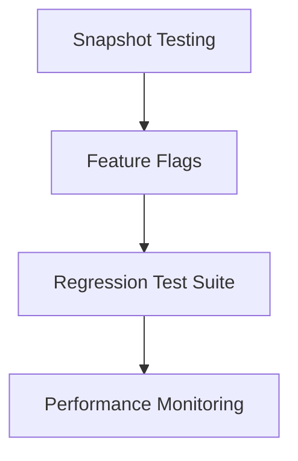

# Stability-Focused Implementation Plan

## 1. Background and Problem Analysis
The previous modular development approach failed to prevent:
- Regression issues disrupting working functionality
- Significant time and resource waste from rework
- Integration instability when adding new features

This plan addresses these issues by prioritizing testing safeguards and controlled rollouts.

## 2. Core Principles
- **Safety First**: Implement testing frameworks before feature development
- **Isolation**: Develop features behind abstraction layers
- **Observability**: Monitor performance continuously
- **Incremental Rollout**: Use phased deployments to limit risk
- **Automated Safeguards**: Prevent regressions programmatically

## 3. Implementation Roadmap

### Phase 1: Safety Nets (Pre-Feature Development)

1. **Snapshot Testing**
   - Capture current working state of core functionality
   - Automatic comparison against future changes
   - Tools: pytest-snapshot, Jest snapshots

2. **Feature Flag System**
   - Enable/disable features without deployment
   - Configuration: `config/feature_flags.yaml`
   - Implementation: Unleash or custom flag manager

3. **Automated Regression Suite**
   - Cover critical user journeys
   - Run on pre-commit and CI pipeline
   - Tools: Playwright for E2E, pytest for backend

4. **Performance Monitoring**
   - Add hooks to measure latency/resource usage
   - Dashboard for real-time observability
   - Tools: Prometheus, Grafana

### Phase 2: Isolated Feature Development

5. **Sentence Alignment Service**
   - Developed as standalone microservice
   - Clear API boundaries with semantic_alignment_service
   - Initial implementation: `src/services/sentence_alignment.py`

6. **Fallback Mechanisms**
   - Graceful degradation when dependencies missing
   - Example: spaCy → regex fallback for segmentation

7. **Phased Rollout Plan**
   - Canary releases to 10% of traffic initially
   - Automated rollback on error threshold breach
   - Monitoring: Error rates, latency percentiles

## 4. Validation Strategy

| Checkpoint | Validation Method | Success Criteria |
|------------|-------------------|------------------|
| Pre-implementation | Snapshot verification | 100% match with production behavior |
| Feature development | Isolation testing | Zero impact on existing APIs |
| Deployment | Canary analysis | <0.5% error rate in canary group |
| Post-deployment | Performance monitoring | <10% latency increase from baseline |

## 5. Expected Outcomes

1. **Risk Reduction**: New features won't break existing functionality
2. **Efficiency**: Faster debugging through better observability
3. **Quality**: Higher reliability through automated safeguards
4. **Confidence**: Controlled rollout minimizes impact of issues

## 6. Maintenance Plan
- Weekly review of test coverage
- Automated alerting for performance regressions
- Bi-weekly refinement of feature flags
- Documentation updated with each phase completion

/* 
Developed with stability-first approach by NET-EST Team
Last Updated: 2025-08-22
*/